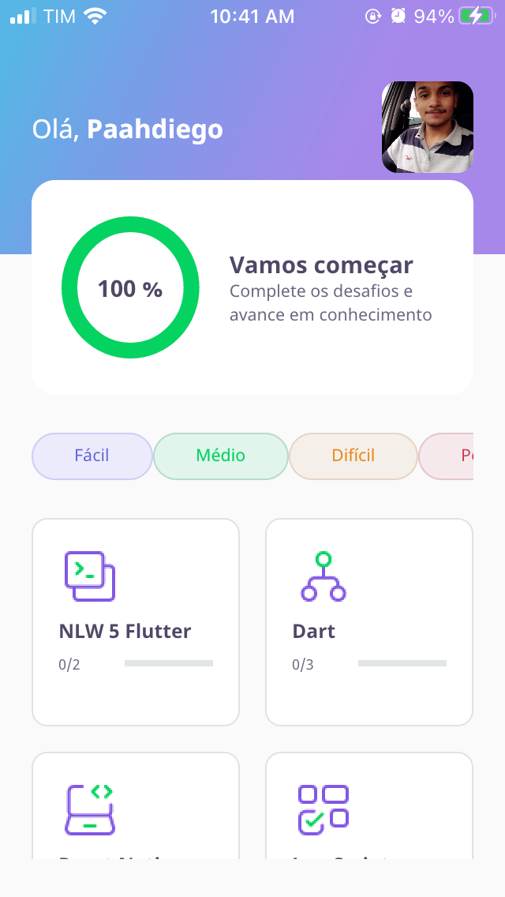

<!-- PROJECT LOGO -->
<br />
<p align="center">

  


  <h3 align="center">DevQuiz</h3>

  <p align="center">
    Repositório com os arquivos e aplicação "DEVQUIZ" replicados durante a "NextLevelWeek 5.0".
    <br />
  </p>
</p>


<!-- TABLE OF CONTENTS -->
<details open="open">
  <summary>Sumário</summary>
  <ol>
    <li>
      <a href="#about-the-project">Sobre o Projeto</a>
      <ul>
        <li><a href="#built-with">Tecnologias utilizadas</a></li>
      </ul>
    </li>
    <li><a href="#getting-started">Instalação</a></li>
    <li><a href="#usage">Uso</a></li>
    <li><a href="#license">License</a></li>
  </ol>
</details>


<!-- ABOUT THE PROJECT -->
## Sobre o Projeto
  <p align="center">
  
  </p>
  </br>
  Trata-se de um aplicativo desenvolvido em Flutter de perguntas e respostas. O app permite que o usuário responda perguntas de um modo "gameficado" com feedback de seus resultados e progresso conforme avança nos Quizzes. Ao fim de um Quiz, o app permite que o usuário compartilhe seu resultado nas redes sociais.

### Tecnologias utilizadas

* [Flutter](https://flutter.dev/)

### Instalação

1. Crie um clone desse repo e acesse o diretório clonado.
   ```sh
   git clone https://github.com/paahdiego/NLW-5-Flutter.git 
   
   ou
   
   git clone git@github.com:paahdiego/NLW-5-Flutter.git
   ```
2. Instalação de dependencias
   ```sh
   flutter pub get
   ```
3. Rodar aplicação
   ```sh
   flutter run
   ```   

<!-- LICENSE -->
## License

Distributed under the MIT License. See `LICENSE` for more information.
